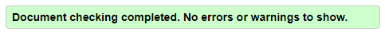

# [**Responsive Portfolio**](https://michellemcconville.github.io/02-responsive-portfolio/) 🔗

## Customer Request

For this project the customer request we

1. Build a portfolio site which meets accessibility standards
2. Use bootstrap CSS Framework
3. Create the following pages
   - index.html
   - portfolio.html
   - contact.html
4. Minimum Requirements
   - Include a consistent Navbar w/ links on each page
   - All links should be working & valid
   - Use responsive layout & images
   - Minimize the use of Media Queries
   - Use Bootstrap's grid system (containers, rows & columns)
   - XS screens should take up entire screen
   - SM & > screens should have margins on left & right
   - Must contain personalized info
   - Use semantic HTML
   - Add a sticky footer w/ sub-rows & columns `(Bonus)`

### **NOTE**: Customer has provided images for reference

---

## Site Pages

### HTML

#### 1. Created index.html file **`|`** [**About Me**](https://michellemcconville.github.io/02-responsive-portfolio/index.html) 🔗

-  This page contains a `<main>` with a wrapper & a `<row>` containing a `<col>`
-  Inside the column `<section>` is a `<h1>` header, photo & text about the customer

#### 2. Created portfolio.html file **`|`** [**Portfolio**](https://michellemcconville.github.io/02-responsive-portfolio/portfolio.html) 🔗

-  This page contains a `<main>` with a wrapper & a `<row>` containing a `<col>`
-  Inside the column `<section>` is a `<h1>` header & 2 `<card-decks>`
-  Each `<card-deck>` holds 3 `<cards>` per deck
-  Within each article `<card>` includes a hyperlinked ``, a `<h5>` heading & text about the related site
-  **The last 3 `<cards>` are saved for future updates & the `<card-deck>` and/or `<cards>` can be duplicated for more options if needed**

#### 3. Created contact.html file **`|`** [**Contact**](https://michellemcconville.github.io/02-responsive-portfolio/contact.html) 🔗

-  This page contains a `<main>` with a wrapper & a `<row>` containing a `<col>`
-  Inside the column `<section>` is a `<h1>` header & a `<form>`
-  Within the `<form>` it request person's:
  1. Name
  2. Email
  3. Message
  4. Submit Button
-  **The `Submit` button and `Form` functionality will be completed as a later date.**

#### 4. Site Wide Components

-  Each page globally encompasses the following:
  - In the `<head>` element, added all the needed `<link>` stylesheets
  - In the `<header>` element, created a sticky `<navbar>` that is collapsible on mobile devices & smaller tablets
  - In the `<footer>` element, created a `<navbar>` that is fixed which contains 2 `<row>` & 2 `<col>` with a copyright symbol & some social media font awesome icons
  - Above ending `</body>` tag, added all the needed `<script>` sources

### CSS

- Created 1 main style.css file
- Organized the style.css file by element `< >` then class `<.>` then id `<#>` within groups
- Create the following groups:
  - `Global, Navbar Top, Index Page, Portfolio Page, Contact Page, Footer Nav, & @Media`

---

## Sources Referenced

[**w3schools**](https://www.w3schools.com/html/html5_semantic_elements.asp) **`|`**
[**MDN web docs**](https://developer.mozilla.org/en-US/) **`|`**
[**Markdown Guide**](https://www.markdownguide.org/) **`|`**
[**google**](https://www.google.com/) **`|`**

- Added the ` html5doctor.com Reset Style Sheet` by [Richard Clark](http://richclarkdesign.com)

---

## Accessibility Standards Validation

Successfully ran code thru [**W3C**](https://validator.w3.org/) validator for all 3 pages

---

## Output for Review

Submitted the following for review:

- The URL of the deployed application
- The URL of the GitHub repository. (**README.md** included)
